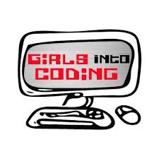
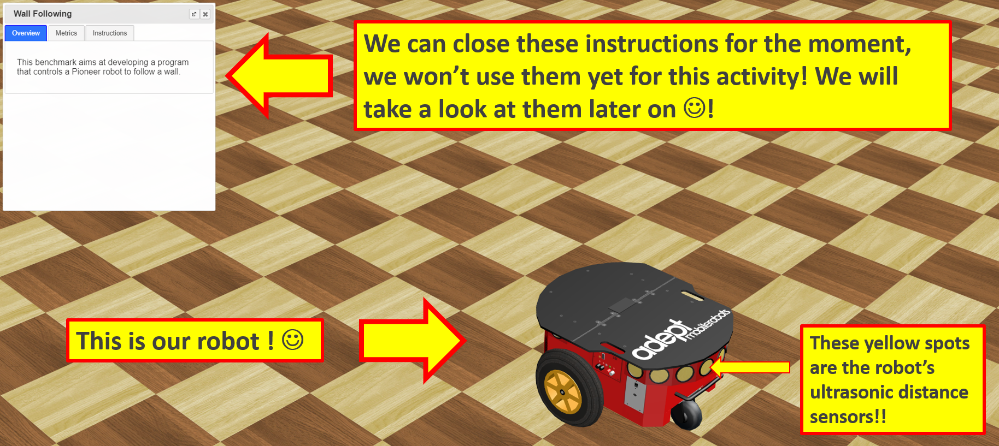

# An online robotics activity for Girls Into Coding

A project activity for [Girls Into Coding](https://www.girlsintocoding.com/) using a online version of the free open source [Webots](https://www.cyberbotics.com/) robot simulator.

This activity is generated as a webpage at [https://meisben.github.io/girlsIntoCoding-robotbenchmark-activity2/](https://meisben.github.io/girlsIntoCoding-robotbenchmark-activity2/)

## Contents

- Overview
- Accessing the activity webpage
- Contributing
- Credit
- Help and updates

## Overview

This activity uses [robotbenchmark](https://robotbenchmark.net/), which is a online version of the [Webots](https://www.cyberbotics.com/) simulator. 

## Accessing the activity webpage

Simply point your browser to [https://meisben.github.io/girlsIntoCoding-robotbenchmark-activity2/](https://meisben.github.io/girlsIntoCoding-robotbenchmark-activity2/)

## Contributing

Feel free very welcome to contribute if you find any errors in this activity, by initiating a pull request

## Credit

This activity uses bootstrap in the github pages website, thanks to [https://nicolas-van.github.io/bootstrap-4-github-pages/]()

## Help and updates

If you have any difficulty with the activity please all initiate a pull request to contact for any help :)
