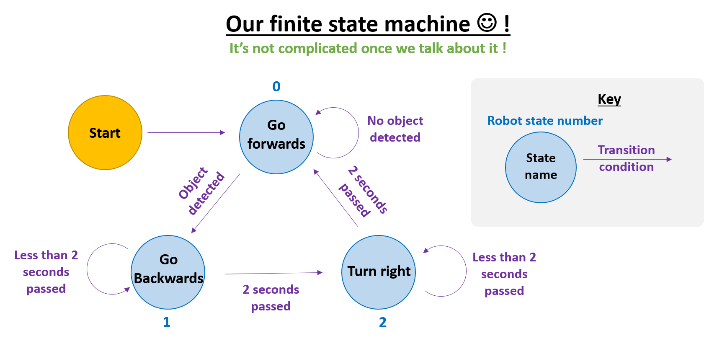

<!--Comment: Above here is the header, we need this to generate the web page-->

<!--Comment: This section is markdown-->

[](https://www.girlsintocoding.com/)

A project activity for [Girls Into Coding](https://www.girlsintocoding.com/) using a online version of the free open source [Webots](https://www.cyberbotics.com/) robot simulator.

<!--Comment: End of markdown section-->

<!--Comment: This is html bootstrap-->

<div id="sessionLinkPanel" class="container p-3 my-3 bg-warning">
<h2>Activity series</h2> 
  <p>This activity session is part of a series on simulating robots, you can see links to all the activities in this series below!</p>
<ul class="list-group">
  <a href="https://meisben.github.io/girlsIntoCoding-robotbenchmark-activity/" target="_blank" class="list-group-item list-group-item-action"><b>Session 1:</b> Intro to robot simulation</a>
  <a href="https://meisben.github.io/girlsIntoCoding-robotbenchmark-activity2/" target="_blank" class="list-group-item list-group-item-action"><b>Session 2:</b> Pick and place with a robot arm</a>
  <a href="https://meisben.github.io/girlsIntoCoding-robotbenchmark-activity3/" target="_blank" class="list-group-item list-group-item-action"><b>Session 3:</b> Robots & Behaviours</a>
</ul>
</div>

<!--Comment: This is the end of html bootstrap-->

<!--Comment: This section is markdown-->

This session is designed to be fun! The idea is that we can follow it together online, but that we can be free to move at our own pace. We're going to be doing some basic python programming in this activity. If you're not too familiar with Python, don't worry, you'll be able to follow along :) !

The idea with this acitivity isn't to become an ACE python programmer in 1 hour, but it's just to get an **appreciation** of programming robots. So that you can use this knowledge for good in the future :)! 

<!--Comment: End of markdown section-->

<!--Comment: This code here is html-->

<!--Comment: This is html paragraph spacing <br>-->
<br>

<!--Comment: This is html bootstrap-->
<div class="container p-3 my-3 bg-primary">
<h2>Contents</h2>
<ul class="list-group">
  <li class="list-group-item"><a href="#resourcesPanel">Resources</a></li>
  <li class="list-group-item"><a href="#Activity1">Activity 1: Let’s get familiar with our robot</a></li>
  <li class="list-group-item"><a href="#Activity2">Activity 2: Let’s make our robot move using python functions</a></li>
  <li class="list-group-item"><a href="#Activity3">Activity 3: How the robot senses objects</a></li>
  <li class="list-group-item"><a href="#Activity4">Activity 4: Changing the robot’s behaviour</a></li>
  <li class="list-group-item"><a href="#Activity5">Activity 5: Making the robot respond to time instead of distance</a></li>
  <li class="list-group-item"><a href="#Activity6">Activity 6: Making the robot change its movement type</a></li>
  <li class="list-group-item"><a href="#Activity7">Activity 7: Creating a state machine</a></li>
</ul>
</div>

<div id="resourcesPanel" class="container p-3 my-3 bg-info">
<h2>Resources</h2> 
  <p>Here's some resources that may help with the activity</p>
<ul class="list-group">
  <a href="https://www.w3schools.com/python/" target="_blank" class="list-group-item list-group-item-action">Python tutorials at W3 Schools</a>
  <a href="https://www.pythoncheatsheet.org/" target="_blank" class="list-group-item list-group-item-action">Python cheatsheet</a>
  <a href="https://www.cyberbotics.com/doc/reference/index" target="_blank" class="list-group-item list-group-item-action">Webots documentation</a>
  <a href="https://robohub.org/30-women-in-robotics-you-need-to-know-about-2019/" target="_blank" class="list-group-item list-group-item-action">30 women in robotics you need to know about – 2019</a>
</ul>
</div>


<!--Comment: This is the end of html bootstrap-->


<!--Comment: Paragrpah spacing-->
<br>
<br>

<!--Comment: This section is markdown again-->

# What exactly are robot behaviours?
---

<!--Comment: End of markdown-->

<!--Comment: Back to html bootstrap -->

<div id="Activity0a" class="container p-3 my-3 bg-primary text-primary">
<h2>Activity #0a</h2>
</div>

<!--Comment: End of html bootstrap -->


<!--Comment: Back to markdown -->

* Let's take a look at what robot behaviours are!
* Navigate to the [robotbenchmark](https://robotbenchmark.net/) website.
* Click on the **Start** button next to the **Pick and place** activity
* You should see the scene below


* Have a look at the simulation at the top right hand side of the screen
* How many behaviours can you see in the robot? Let's discuss this together
* Some example answers are below


<!--Comment: This section is markdown again-->

# How do we program robot behaviours?
---

<!--Comment: End of markdown-->

<!--Comment: Back to html bootstrap -->

<div id="Activity0b" class="container p-3 my-3 bg-primary text-primary">
<h2>Activity #0b</h2>
</div>

<!--Comment: End of html bootstrap -->


<!--Comment: Back to markdown -->

* Let's have a look at how to program robot behaviours together!
* [(1) Robot behaviours with IF statements in python](https://repl.it/join/koipvszj-meisben)
* [(2) Robot behaviours with functions in python](https://repl.it/join/gznuzhur-meisben)
* [(3) Changing robot behaviours in python](https://repl.it/join/dighdlzf-meisben)
* [(1) Robot behaviours with loops in python](https://repl.it/join/rmbdmrny-meisben


<!--Comment: This section is markdown again-->

# Let's get familiar with our robot
---

<!--Comment: End of markdown-->

<!--Comment: Back to html bootstrap -->

<div id="Activity1" class="container p-3 my-3 bg-primary text-primary">
<h2>Activity #1</h2>
</div>

<!--Comment: End of html bootstrap -->


<!--Comment: Back to markdown -->

* We'll be using the [robotbenchmark](https://robotbenchmark.net/) website.
* Click on the **Start** button next to the **Wall Following** activity
* Click on **Start programming this benchmark**
* You should see the scene below


First we're going to get familiar with how we control our view of the 3D simulation. We need to find how many ultrasonic sensors there are! Let's control the viewpoint to count how many ultrasonic sensors there are on the robot.

**Use the mouse to move the viewpoint and count the number of sensors**
* **Rotate:** click on a 3D object in the scene with the left mouse button and drag the mouse pointer. The viewpoint will rotate around the object.
* **Translate:** click in the scene with the right mouse button and drag the mouse pointer.
* **Zoom:** click in the 3D scene and roll the mouse wheel. It is also possible to zoom by pressing the mouse wheel and dragging the mouse forward or backwards.
* **Tilt:** press the mouse wheel over the 3D scene and drag the mouse to the left or to the right. Pressing simultaneously the left and right mouse buttons is equivalent to pressing the mouse wheel.


<!--Comment: End of markdown-->

<!--Comment: Back to html bootstrap -->


<div class="container">
  <button type="button" class="btn btn-danger" data-toggle="collapse" data-target="#demo1">Answer</button>
  <div id="demo1" class="collapse" markdown="1">
  There are 16 ultrasonic sensors, 4 at the front of the robot and 4 at the back!
  </div>
</div>

<br>

<!--Comment: End of html bootstrap -->

<!--Comment: This section is markdown again-->

# Let's make our robot move using python functions
---

<!--Comment: End of markdown-->

<!--Comment: Back to html bootstrap -->

<div id="Activity2" class="container p-3 my-3 bg-primary text-primary">
<h2>Activity #2</h2>
</div>

<!--Comment: End of html bootstrap -->

<!--Comment: Back to markdown -->

* We're still going to be using the [Wall Following](https://robotbenchmark.net/benchmark/wall_following/simulation.php) activity at the [robotbenchmark](https://robotbenchmark.net/) website. So you can keep this open all the time!
* We're going to get our robot moving!!
* When you're ready to program the robot, right click on it, and select **Edit controller**


* A window will pop up with python code in it! This is how we program our virtual robot.
* Delete all the code in the robot controller window, by hightlighting it all (or pressing **ctrl-A**) and then pressing **delete**
* Copy and paste the **'Activity Base Code'** code from below (click the green button) into the robot controller window, by hightlighting it all then right clicking and pressing **copy** (or pressing **ctrl+C**)
  


* Start the simulation by following the instrucitons in the image above
* You should see the robot approach the wall, but then reverse quickly when it senses it!
* Have a look at the python functions that are making the robot move in the 'Start of main program' section of the code. We'll discuss these together!

<div class="container">
  <button type="button" class="btn btn-primary" data-toggle="collapse" data-target="#demo1a">Activity Base Code</button>
  <div id="demo1a" class="collapse" markdown="1">

```python
"""
Purpose: Sample base code controller for the 'finite state machine' girls into coding activity

Notes: Hi! we're going to be editing this program together to make the robot move. It's important 
that this is a fun activity! If anything is unclear please ask! We're really happy to help. A lot
of the code is already written to make this activity possible. The parts of the code that you 
should edit are the parts betweeen the squigly lines! like this...

# ~*~*~*~*~*~*~*~*~*~*~*~*~*~*~*~*~*~*
# ~~~~ MAKE YOUR EDITS BELOW HERE ~~~
# ~*~*~*~*~*~*~*~*~*~*~*~*~*~*~*~*~*~*

# some edits that we make together

# ~*~*~*~*~*~*~*~*~*~*~*~*~*~*~*~*~*~*
# ~~~~ END OF YOUR CODE EDITS ~~~
# ~*~*~*~*~*~*~*~*~*~*~*~*~*~*~*~*~*~*
"""

#---------------------
# Python library imports
#---------------------

from controller import Robot # imports the language of the robot ! 

#---------------------
# Starting up the robot
#---------------------

# Get pointer to the robot. So that we can talk to it!
robot = Robot()

# Get pointer to the robot wheels motors.
leftWheel = robot.getMotor('left wheel')
rightWheel = robot.getMotor('right wheel')

# We will use the velocity parameter of the wheels, so we need to
# set the target position to infinity. This means they will keep turning
# for ever unless we set their velocity to zero
leftWheel.setPosition(float('inf'))
rightWheel.setPosition(float('inf'))

# Put all the ultrasonic sensors in an array
sensors = []
sensors.append(robot.getDistanceSensor("so0"))
sensors.append(robot.getDistanceSensor("so1"))
sensors.append(robot.getDistanceSensor("so2"))
sensors.append(robot.getDistanceSensor("so3"))
sensors.append(robot.getDistanceSensor("so4"))
sensors.append(robot.getDistanceSensor("so5"))
sensors.append(robot.getDistanceSensor("so6"))
sensors.append(robot.getDistanceSensor("so7"))

# Get the time step of the current world (the smallest time unit)
timestep = int(robot.getBasicTimeStep())

# Switch all the sensors on
for sensor in sensors:
    sensor.enable(timestep)


#---------------------
# Helpful functions for controling the robot (for the girls into coding activity)
#---------------------

def stopRobotWheels():
    """
    Purpose: stop the robot
    Notes: mySpeed -> can take values from 1-9
    """
    leftWheel.setVelocity(0.0)
    rightWheel.setVelocity(0.0)
        
        
def startMoveForward(mySpeed):
    """
    Purpose: move the robot forward
    Notes: mySpeed -> can take values from 1-9
    """
    leftWheel.setVelocity(mySpeed)
    rightWheel.setVelocity(mySpeed)
    
def startMoveBackward(mySpeed):
    """
    Purpose: move the robot backward
    Notes: mySpeed -> can take values from 1-9
    """
    leftWheel.setVelocity(-mySpeed)
    rightWheel.setVelocity(-mySpeed)
    
def startTurnLeft(mySpeed):
    """
    Purpose: turn the robot left
    Notes: mySpeed -> can take values from 1-9
    """
    leftWheel.setVelocity(-mySpeed)
    rightWheel.setVelocity(mySpeed)
    
def startTurnRight(mySpeed):
    """
    Purpose: turn the robot right
    Notes: mySpeed -> can take values from 1-9
    """
    leftWheel.setVelocity(mySpeed)
    rightWheel.setVelocity(-mySpeed)
    
    

def getClosestObjectToRobot():
    """
    Purpose: Return the direction and distance for the closest object to the robot
    
    Notes: Refer to the diagrams on the girls into coding webpage for the distance
    convention. The distance is returned in meters. The value returned by the getValue() 
    method of the distance sensors corresponds to a physical value (here we have a sonar, 
    so it is the strength of the sonar ray). This function makes a conversion to a
    distance value in meters.
    """
    
    # Make local variables
    maxSensorRange = 1.6 # in meters
    currentSensorID = -1
    lowestSensorDistance = maxSensorRange
    lowestSensorID = None
    
    # Find the closest object to the robot and save the direction and distance (in m)
    for sensor in sensors:
        # calculate the distance in m (this formula is provided by the sensor manufacturer)
        currentSensorDistance = ((1000 - sensor.getValue()) / 1000) * 5
        currentSensorID = currentSensorID + 1
        
        if currentSensorDistance < lowestSensorDistance:
            lowestSensorDistance = currentSensorDistance
            lowestSensorID = currentSensorID
    
    # If no object is found, then return 'None' otherwise return the value       
    if lowestSensorID != None:
        currentDirection = lowestSensorID -3
    else:
        currentDirection = None
        lowestSensorDistance = None
        
    return currentDirection, lowestSensorDistance

#---------------------
# Start of main program
#---------------------

# Our starting message for the program
print("--------------")
print("Here is an example of how we write a message to the console")
print("Program starting !!")
print("--------------")


# Move forward 
startMoveForward(5)
# Keep going until we are 20cm away from the wall
while True:
    robot.step(500) # keep going for 0.5 seconds (value is in milli seconds (ms))
    direction, distance = getClosestObjectToRobot() # Get the info on the closest object
    print("direction = {}, distance = {}").format(direction, distance)  # Print the info on the closest object
    # If there is an object too close, then stop moving forward!
    if distance != None and distance < 0.2:
        break
    

# ~*~*~*~*~*~*~*~*~*~*~*~*~*~*~*~*~*~*
# ~~~~ MAKE YOUR EDITS BELOW HERE ~~~
# ~*~*~*~*~*~*~*~*~*~*~*~*~*~*~*~*~*~*
    
    
print("hello :)")
    
# Move backward 
startMoveBackward(5)
# Keep going until we are 1m away from the wall
while True:
    robot.step(500)
    direction, distance = getClosestObjectToRobot()
    print("direction = {}, distance = {}").format(direction, distance) 
    # If the object is too far, then stop moving backward!
    if distance != None and distance > 1:
        break
    
    
# ~*~*~*~*~*~*~*~*~*~*~*~*~*~*~*~*~*~*
# ~~~~ END OF YOUR CODE EDITS ~~~
# ~*~*~*~*~*~*~*~*~*~*~*~*~*~*~*~*~*~*
    
stopRobotWheels()
```

  </div>
</div>

<br>


# Let's see how the robot is sensing objects
---

<!--Comment: End of markdown-->

<!--Comment: Back to html bootstrap -->

<div id="Activity3" class="container p-3 my-3 bg-primary text-primary">
<h2>Activity #3</h2>
</div>

<!--Comment: End of html bootstrap -->

<!--Comment: Back to markdown -->

* We're still going to be using the [Wall Following](https://robotbenchmark.net/benchmark/wall_following/simulation.php) activity
* Let's have a look at how the robot is sensing the wall
* Open up the console by following the instructions in the image below, then run the simulation

* The console is where the robot prints messages to us!
* Let's discuss what it is saying
* Every 0.5 seconds we are asking the robot to tell us the distance of any objects from it's ultrasonic sensors
* It is telling us the distance by printing this to the console
* The diagram below shows how they work!

[](images/image6.png)


**Questions**
*Let's answer these questions as a group*
* Can you see the moment at which the robot detects the distance to the wall? 
* How does the robot detect the wall?
* What should the robot do when it detects a wall?


<div class="container">
  <button type="button" class="btn btn-info" data-toggle="collapse" data-target="#demo1b">Hint</button>
  <div id="demo1b" class="collapse" markdown="1">
  Try having a look at the function **getClosestObjectToRobot()** to see what it does!
  </div>
</div>

<br>

<div class="container">
  <button type="button" class="btn btn-danger" data-toggle="collapse" data-target="#demo1c">Answer</button>
  <div id="demo1c" class="collapse" markdown="1">

  * The robot detects the wall when it is 1.5 meters away
  * The robot detects the wall using the ultrasonic sensors
  * When the robot detects the wall we need it to change behaviour (e.g. stop, or turn, or move backwards!)
  
  </div>
</div>

<br>


# Let's change the robot's behaviour
---

<!--Comment: End of markdown-->

<!--Comment: Back to html bootstrap -->

<div id="Activity4" class="container p-3 my-3 bg-primary text-primary">
<h2>Activity #4</h2>
</div>

<!--Comment: End of html bootstrap -->

<!--Comment: Back to markdown -->

* What would we do if we wanted to change the behaviour of the robot when it reaches the wall? 
* Let's alter the code together to make this happen! Our goal is to make the robot move backwards, but not as far.
* Open the 'controller' (code editor) for the robot


* Scroll to the section of the code which looks like this (it should be lines 168-189):

```python
# ~*~*~*~*~*~*~*~*~*~*~*~*~*~*~*~*~*~*
# ~~~~ MAKE YOUR EDITS BELOW HERE ~~~
# ~*~*~*~*~*~*~*~*~*~*~*~*~*~*~*~*~*~*
    
    
print("hello :)")
    
# Move backward 
startMoveBackward(5)
# Keep going until we are 1m away from the wall
while True:
    robot.step(500)
    direction, distance = getClosestObjectToRobot()
    print("direction = {}, distance = {}").format(direction, distance) 
    # If the object is too far, then stop moving backward!
    if distance != None and distance > 1:
        break
    
    
# ~*~*~*~*~*~*~*~*~*~*~*~*~*~*~*~*~*~*
# ~~~~ END OF YOUR CODE EDITS ~~~
# ~*~*~*~*~*~*~*~*~*~*~*~*~*~*~*~*~*~*
```

* Let's discuss this code together.
* How would we change the code so that when the robot changes direction (from fowards to backwards) then it prints our name e.g. "hello there ..."?
* How would we make the robot move backwards less far?
* Take a look at the hint and example answers if you're stuck!

<!--Comment: End of markdown-->

<!--Comment: Back to html bootstrap -->

<div class="container">
  <button type="button" class="btn btn-info" data-toggle="collapse" data-target="#demo2">Hint</button>
  <div id="demo2" class="collapse" markdown="1">
  For printing to the console, try having a look at the code line: print("hello :)")

  For the movement, try having a look at the "if statement"!
  </div>
</div>

<br>

<div class="container">
  <button type="button" class="btn btn-danger" data-toggle="collapse" data-target="#demo3">Example Answer</button>
  <div id="demo3" class="collapse" markdown="1">

  ```python
# ~*~*~*~*~*~*~*~*~*~*~*~*~*~*~*~*~*~*
# ~~~~ MAKE YOUR EDITS BELOW HERE ~~~
# ~*~*~*~*~*~*~*~*~*~*~*~*~*~*~*~*~*~*
    
    
print("hello there Nikita")
    
# Move backward 
startMoveBackward(5)
# Keep going until we are 1m away from the wall
while True:
    robot.step(500)
    direction, distance = getClosestObjectToRobot()
    print("direction = {}, distance = {}").format(direction, distance) 
    # If the object is too far, then stop moving backward!
    # We change this value to 0.5 so the robot travels on 0.5m backwards from the wall
    if distance != None and distance > 0.75:
        break
    
    
# ~*~*~*~*~*~*~*~*~*~*~*~*~*~*~*~*~*~*
# ~~~~ END OF YOUR CODE EDITS ~~~
# ~*~*~*~*~*~*~*~*~*~*~*~*~*~*~*~*~*~*
  ```

  </div>
</div>

<br>


<!--Comment: End of html bootstrap -->

<!--Comment: Back to markdown -->

# Making the robot respond to time instead of distance
---

<!--Comment: End of markdown-->

<!--Comment: Back to html bootstrap -->

<div id="Activity5" class="container p-3 my-3 bg-primary text-primary">
<h2>Activity #5</h2>
</div>

<!--Comment: End of html bootstrap -->

<!--Comment: Back to markdown -->

* What would we do if we wanted to change the movement so the robot changes behaviour after a time period?
* Let's alter the code together to make this happen! Our goal is to make the robot stop moving backwards after 2 seconds has elapsed
* Open the 'controller' (code editor) for the robot


* Scroll to the section of the code which looks like this (it should be lines 168-189):

```python
# ~*~*~*~*~*~*~*~*~*~*~*~*~*~*~*~*~*~*
# ~~~~ MAKE YOUR EDITS BELOW HERE ~~~
# ~*~*~*~*~*~*~*~*~*~*~*~*~*~*~*~*~*~*
    
    
print("hello there Nikita")
    
# Move backward 
startMoveBackward(5)
# Keep going until we are 1m away from the wall
while True:
    robot.step(500)
    direction, distance = getClosestObjectToRobot()
    print("direction = {}, distance = {}").format(direction, distance) 
    # If the object is too far, then stop moving backward!
    # We change this value to 0.5 so the robot travels on 0.5m backwards from the wall
    if distance != None and distance > 0.75:
        break
    
    
# ~*~*~*~*~*~*~*~*~*~*~*~*~*~*~*~*~*~*
# ~~~~ END OF YOUR CODE EDITS ~~~
# ~*~*~*~*~*~*~*~*~*~*~*~*~*~*~*~*~*~*
```

* Let's discuss this code together.
* How would we change the code so that robot stops after 2 seconds has elapsed
* Have a look at the hint to make a start!

<!--Comment: End of markdown-->

<!--Comment: Back to html bootstrap -->

<div class="container">
  <button type="button" class="btn btn-info" data-toggle="collapse" data-target="#demo2">Hint</button>
  <div id="demo2" class="collapse" markdown="1">
  Look at the line *"robot.step(500)"*. This is the number of milliseconds that passes each time the robot moves. If we count these milliseconds we can change the IF statement!
  </div>
</div>

<br>

<div class="container">
  <button type="button" class="btn btn-danger" data-toggle="collapse" data-target="#demo3">Example Answer</button>
  <div id="demo3" class="collapse" markdown="1">

```python
# ~*~*~*~*~*~*~*~*~*~*~*~*~*~*~*~*~*~*
# ~~~~ MAKE YOUR EDITS BELOW HERE ~~~
# ~*~*~*~*~*~*~*~*~*~*~*~*~*~*~*~*~*~*
    
    
print("hello there Nikita")
    
# Move backward 
startMoveBackward(5)
# Keep going for 2 seconds
milliSeconds = 0
while True:
    robot.step(500)
    milliSeconds = milliSeconds + 500
    direction, distance = getClosestObjectToRobot()
    print("time = {}").format(milliSeconds) 
    # If the time is longer than 2 seconds, then stop moving!
    if milliSeconds > 2000:
        break
    
# ~*~*~*~*~*~*~*~*~*~*~*~*~*~*~*~*~*~*
# ~~~~ END OF YOUR CODE EDITS ~~~
# ~*~*~*~*~*~*~*~*~*~*~*~*~*~*~*~*~*~*
```

  </div>
</div>

<br>

<!--Comment: End of html bootstrap -->

<!--Comment: Back to markdown -->

<!--Comment: End of html bootstrap -->

<!--Comment: Back to markdown -->

# Avoiding the walls!
---

<!--Comment: End of markdown-->

<!--Comment: Back to html bootstrap -->

<div id="Activity6" class="container p-3 my-3 bg-primary text-primary">
<h2>Activity #6</h2>
</div>

<!--Comment: End of html bootstrap -->

<!--Comment: Back to markdown -->

* What would we do if we wanted to change the movement of the robot so that it starts to avoid walls? 
* Let's alter the code together to make this happen! Our goal is to make the robot turn after it has moved backwards
* Open the 'controller' (code editor) for the robot
* Scroll to the section of the code which looks like this (it should be lines 168-189):

```python
# ~*~*~*~*~*~*~*~*~*~*~*~*~*~*~*~*~*~*
# ~~~~ MAKE YOUR EDITS BELOW HERE ~~~
# ~*~*~*~*~*~*~*~*~*~*~*~*~*~*~*~*~*~*
    
    
print("hello there Nikita")
    
# Move backward 
startMoveBackward(5)
# Keep going for 2 seconds
milliSeconds = 0
while True:
    robot.step(500)
    milliSeconds = milliSeconds + 500
    direction, distance = getClosestObjectToRobot()
    print("time = {}").format(milliSeconds) 
    # If the time is longer than 2 seconds, then stop moving!
    if milliSeconds > 2000:
        break
    
    
# ~*~*~*~*~*~*~*~*~*~*~*~*~*~*~*~*~*~*
# ~~~~ END OF YOUR CODE EDITS ~~~
# ~*~*~*~*~*~*~*~*~*~*~*~*~*~*~*~*~*~*
```

* Let's discuss this code together.
* How would we change the code so that robot turns when it has finished going backwards?
* Have a look at the hint to make a start!

<!--Comment: End of markdown-->

<!--Comment: Back to html bootstrap -->

<div class="container">
  <button type="button" class="btn btn-info" data-toggle="collapse" data-target="#demo2">Hint</button>
  <div id="demo2" class="collapse" markdown="1">
  Try having a look at the function called 'startTurnRight(mySpeed)'. How would you add this to the code to make the robot turn right.
  </div>
</div>

<br>

<div class="container">
  <button type="button" class="btn btn-danger" data-toggle="collapse" data-target="#demo3">Example Answer</button>
  <div id="demo3" class="collapse" markdown="1">
  
```python
# ~*~*~*~*~*~*~*~*~*~*~*~*~*~*~*~*~*~*
# ~~~~ MAKE YOUR EDITS BELOW HERE ~~~
# ~*~*~*~*~*~*~*~*~*~*~*~*~*~*~*~*~*~*
    
        
print("hello there Nikita")
    
# Move backward 
startMoveBackward(5)
# Keep going for 2 seconds
milliSeconds = 0
while True:
    robot.step(500)
    milliSeconds = milliSeconds + 500
    direction, distance = getClosestObjectToRobot()
    print("time = {}").format(milliSeconds) 
    # If the time is longer than 2 seconds, then stop moving!
    if milliSeconds > 2000:
        break

# Turn 
startTurnRight(5)
# Keep going for 2 seconds
milliSeconds = 0
while True:
    robot.step(500)
    milliSeconds = milliSeconds + 500
    print("time = {}").format(milliSeconds) 
    # If the time is too long, then stop moving!
    if milliSeconds > 2000:
        break
    
    
# ~*~*~*~*~*~*~*~*~*~*~*~*~*~*~*~*~*~*
# ~~~~ END OF YOUR CODE EDITS ~~~
# ~*~*~*~*~*~*~*~*~*~*~*~*~*~*~*~*~*~*
```

  </div>
</div>

<br>

<!--Comment: End of html bootstrap -->

<!--Comment: Back to markdown -->

# State machines
---

<!--Comment: End of markdown-->

<!--Comment: Back to html bootstrap -->

<div id="Activity7" class="container p-3 my-3 bg-primary text-primary">
<h2>Activity #7</h2>
</div>

<!--Comment: End of html bootstrap -->

<!--Comment: Back to markdown -->

* Our goal is to make the robot behaviour so that it randomly explores the map!
* To keep going for ever it will need to avoid walls, and keep repeating behaviours
* We could do this with loops! But it can get a bit complicated.
* A really powerful idea for robot behaviours are state machines
* It might sound scary but it's really not!! Let's take a look at what a state machine is together ! 
  
[](images/image7.png)

* As we can see in the images, we just have some robot behaviours, and we call them states!
* We've already created these robot behaviours, so there's not much more to do
* Let's have a look at one kind of program structure for a state machine in python
* Here is some pseudo code which shows how it works

[](images/image8.png)

* So let's implement this for the robot simulation together!
* Delete all the code in the robot controller window, by hightlighting it all (or pressing **ctrl-A**) and then pressing **delete**
* Copy and paste the **'State Machine Code'** code from below (click the green button) into the robot controller window, by hightlighting it all then right clicking and pressing **copy** (or pressing **ctrl+C**)
  


* Start the simulation by following the instrucitons in the image above
* You should see the robot have the behaviours we programmed in the state machine
* Have a look at the python functions that are making the robot move in the **'Our States'** and **'Our State Machine'** section of the code

<div class="container">
  <button type="button" class="btn btn-primary" data-toggle="collapse" data-target="#demo7">State Machine Code</button>
  <div id="demo7" class="collapse" markdown="1">

```python
"""
Purpose: State machine controller for the 'finite state machine' girls into coding activity

Notes: Hi! we're going to be editing this program together to make the robot move. It's important 
that this is a fun activity! If anything is unclear please ask! We're really happy to help. A lot
of the code is already written to make this activity possible. The parts of the code that you 
should edit are the parts betweeen the squigly lines! like this...

# ~*~*~*~*~*~*~*~*~*~*~*~*~*~*~*~*~*~*
# ~~~~ MAKE YOUR EDITS BELOW HERE ~~~
# ~*~*~*~*~*~*~*~*~*~*~*~*~*~*~*~*~*~*

# some edits that we make together

# ~*~*~*~*~*~*~*~*~*~*~*~*~*~*~*~*~*~*
# ~~~~ END OF YOUR CODE EDITS ~~~
# ~*~*~*~*~*~*~*~*~*~*~*~*~*~*~*~*~*~*
"""

#---------------------
# Python library imports
#---------------------

from controller import Robot # imports the language of the robot ! 

#---------------------
# Starting up the robot
#---------------------

# Get pointer to the robot. So that we can talk to it!
robot = Robot()

# Get pointer to the robot wheels motors.
leftWheel = robot.getMotor('left wheel')
rightWheel = robot.getMotor('right wheel')

# We will use the velocity parameter of the wheels, so we need to
# set the target position to infinity. This means they will keep turning
# for ever unless we set their velocity to zero
leftWheel.setPosition(float('inf'))
rightWheel.setPosition(float('inf'))

# Put all the ultrasonic sensors in an array
sensors = []
sensors.append(robot.getDistanceSensor("so0"))
sensors.append(robot.getDistanceSensor("so1"))
sensors.append(robot.getDistanceSensor("so2"))
sensors.append(robot.getDistanceSensor("so3"))
sensors.append(robot.getDistanceSensor("so4"))
sensors.append(robot.getDistanceSensor("so5"))
sensors.append(robot.getDistanceSensor("so6"))
sensors.append(robot.getDistanceSensor("so7"))

# Get the time step of the current world (the smallest time unit)
timestep = int(robot.getBasicTimeStep())

# Switch all the sensors on
for sensor in sensors:
  sensor.enable(timestep)


#---------------------
# Helpful functions for controling the robot (for the girls into coding activity)
#---------------------

def stopRobotWheels():
  """
  Purpose: stop the robot
  Notes: mySpeed -> can take values from 1-9
  """
  leftWheel.setVelocity(0.0)
  rightWheel.setVelocity(0.0)
      
      
def startMoveForward(mySpeed):
  """
  Purpose: move the robot forward
  Notes: mySpeed -> can take values from 1-9
  """
  leftWheel.setVelocity(mySpeed)
  rightWheel.setVelocity(mySpeed)
  
def startMoveBackward(mySpeed):
  """
  Purpose: move the robot backward
  Notes: mySpeed -> can take values from 1-9
  """
  leftWheel.setVelocity(-mySpeed)
  rightWheel.setVelocity(-mySpeed)
  
def startTurnLeft(mySpeed):
  """
  Purpose: turn the robot left
  Notes: mySpeed -> can take values from 1-9
  """
  leftWheel.setVelocity(-mySpeed)
  rightWheel.setVelocity(mySpeed)
  
def startTurnRight(mySpeed):
  """
  Purpose: turn the robot right
  Notes: mySpeed -> can take values from 1-9
  """
  leftWheel.setVelocity(mySpeed)
  rightWheel.setVelocity(-mySpeed)
  
def getClosestObjectToRobot():
  """
  Purpose: Return the direction and distance for the closest object to the robot
  
  Notes: Refer to the diagrams on the girls into coding webpage for the distance
  convention. The distance is returned in meters. The value returned by the getValue() 
  method of the distance sensors corresponds to a physical value (here we have a sonar, 
  so it is the strength of the sonar ray). This function makes a conversion to a
  distance value in meters.
  """
  
  # Make local variables
  maxSensorRange = 1.6 # in meters
  currentSensorID = -1
  lowestSensorDistance = maxSensorRange
  lowestSensorID = None
  
  # Find the closest object to the robot and save the direction and distance (in m)
  for sensor in sensors:
      # calculate the distance in m (this formula is provided by the sensor manufacturer)
      currentSensorDistance = ((1000 - sensor.getValue()) / 1000) * 5
      currentSensorID = currentSensorID + 1
      
      if currentSensorDistance < lowestSensorDistance:
          lowestSensorDistance = currentSensorDistance
          lowestSensorID = currentSensorID
  
  # If no object is found, then return 'None' otherwise return the value       
  if lowestSensorID != None:
      currentDirection = lowestSensorID -3.5
  else:
      currentDirection = None
      lowestSensorDistance = None
      
  return currentDirection, lowestSensorDistance


#---------------------
# Our States
#---------------------   
  
def goForwardsToWall():
  """
  Purpose: make the robot reach the wall and then change state
  Notes: robot stops 20cm from the wall
  """
  global robotState
  # Move forward 
  startMoveForward(5)
  # Keep going until we are 20cm away from the wall
  while True:
      robot.step(500) # keep going for 0.5 seconds (value is in milli seconds (ms))
      direction, distance = getClosestObjectToRobot() # Get the info on the closest object
      print("direction = {}, distance = {}").format(direction, distance)  # Print the info on the closest object
      # If there is an object too close, then stop moving forward!
      if distance != None and distance < 0.2:
          break
  robotState = 1
  
  

def goBackwardsFromWall():
  """
  Purpose: make the robot move away from the wall and then change state
  Notes: robot stops 1m from the wall
  """
  global robotState
  # Move backward 
  startMoveBackward(5)
  # Keep going until we are 1m away from the wall
  while True:
      robot.step(500)
      direction, distance = getClosestObjectToRobot()
      print("direction = {}, distance = {}").format(direction, distance) 
      # If the object is too far, then stop moving backward!
      if distance != None and distance > 1:
          break
  robotState = 2
  
  
def robotSpin():
  """
  Purpose: make the robot spin around 1 time :)
  Notes: you need to edit this function to make it work
  """
  # we want the robot to do a spin but it should end up facing the wall !
  
  global robotState
  # Start spining with speed = 5
  startTurnRight(5)
  # Keep going for 2 seconds
  timePassed = 0
  while True:
      robot.step(500) # 500 milli seconds
      timePassed = timePassed + 500
      direction, distance = getClosestObjectToRobot()
      print("direction = {}, distance = {}").format(direction, distance)
      print("time passed = {}").format(timePassed)
      
      # ~*~*~*~*~*~*~*~*~*~*~*~*~*~*~*~*~*~*
      # ~~~~ MAKE YOUR EDITS BELOW HERE ~~~
      # ~*~*~*~*~*~*~*~*~*~*~*~*~*~*~*~*~*~*
      
      # If the the time is too big, then stop spinning!
      if timePassed > 2000: # 2 seconds!
          break

      # ~*~*~*~*~*~*~*~*~*~*~*~*~*~*~*~*~*~*
      # ~~~~ END OF YOUR CODE EDITS ~~~
      # ~*~*~*~*~*~*~*~*~*~*~*~*~*~*~*~*~*~*
      
  robotState = 0

#---------------------
# Our State Machine
#--------------------- 

# The robot state is passed to the switcher object
switcher = {
  0: goForwardsToWall,
  1: goBackwardsFromWall,
  2: robotSpin
  }

# Create our state machine
def ourStateMachine(robotState):

  # Defines error message if incorrect state is requested
  func = switcher.get(robotState, "Invalid State") 
  func()


#---------------------
# Start of main program
#---------------------

# Our starting message for the program
print("--------------")
print("Here is an example of how we write a message to the console")
print("Program starting !!")
print("--------------")

robotState = 0
NumberMovementsCount = 0

# ~*~*~*~*~*~*~*~*~*~*~*~*~*~*~*~*~*~*
# ~~~~ MAKE YOUR EDITS BELOW HERE ~~~
# ~*~*~*~*~*~*~*~*~*~*~*~*~*~*~*~*~*~*

  
while True:
    ourStateMachine(robotState)
    print("robotState = {}").format(robotState)
  
# ~*~*~*~*~*~*~*~*~*~*~*~*~*~*~*~*~*~*
# ~~~~ END OF YOUR CODE EDITS ~~~
# ~*~*~*~*~*~*~*~*~*~*~*~*~*~*~*~*~*~*
  
stopRobotWheels()
```

  </div>
</div>

<br>


<!--Comment: End of html bootstrap -->

<!--Comment: Back to markdown -->

# Changing the state machine behaviours
---

<!--Comment: End of markdown-->

<!--Comment: Back to html bootstrap -->

<div id="Activity8" class="container p-3 my-3 bg-primary text-primary">
<h2>Activity #8</h2>
</div>

<!--Comment: End of html bootstrap -->

<!--Comment: Back to markdown -->

* The state machine allows us to very easily change the behaviour of the robot!
* Let's change the behaviour to make a state machine that does the following
* (1) Go towards wall (2) Make a 360 degree spin (3) Go backwards away from wall (4) Repeat
* How would we change the code to do this? 
* First let's make the spin happen!
* Have a look at the robotSpin() function, you can see this below
* How can you change the time value to make the robot spin 360 degree (one complete turn?)

```python

def robotSpin():
  """
  Purpose: make the robot spin around 1 time :)
  Notes: you need to edit this function to make it work
  """
  # we want the robot to do a spin but it should end up facing the wall !
  
  global robotState
  # Start spining with speed = 5
  startTurnRight(5)
  # Keep going for 2 seconds
  timePassed = 0
  while True:
      robot.step(500) # 500 milli seconds
      timePassed = timePassed + 500
      direction, distance = getClosestObjectToRobot()
      print("direction = {}, distance = {}").format(direction, distance)
      print("time passed = {}").format(timePassed)
      
      # ~*~*~*~*~*~*~*~*~*~*~*~*~*~*~*~*~*~*
      # ~~~~ MAKE YOUR EDITS BELOW HERE ~~~
      # ~*~*~*~*~*~*~*~*~*~*~*~*~*~*~*~*~*~*
      
      # If the the time is too big, then stop spinning!
      if timePassed > 2000: # 2 seconds!
          break

      # ~*~*~*~*~*~*~*~*~*~*~*~*~*~*~*~*~*~*
      # ~~~~ END OF YOUR CODE EDITS ~~~
      # ~*~*~*~*~*~*~*~*~*~*~*~*~*~*~*~*~*~*
      
  robotState = 0

```


* Now lets look at the state machine
* How can we change the transition conditions to change the order of behaviours? 
* What we want to achieve is shown in the image below
* Notice the change in arrow directions !!

[](images/image9.png)

<div class="container">
  <button type="button" class="btn btn-danger" data-toggle="collapse" data-target="#demo8">Example Answer</button>
  <div id="demo8" class="collapse" markdown="1">

```python

"""
Purpose: State machine controller for the 'finite state machine' girls into coding activity

Notes: Hi! we're going to be editing this program together to make the robot move. It's important 
that this is a fun activity! If anything is unclear please ask! We're really happy to help. A lot
of the code is already written to make this activity possible. The parts of the code that you 
should edit are the parts betweeen the squigly lines! like this...

# ~*~*~*~*~*~*~*~*~*~*~*~*~*~*~*~*~*~*
# ~~~~ MAKE YOUR EDITS BELOW HERE ~~~
# ~*~*~*~*~*~*~*~*~*~*~*~*~*~*~*~*~*~*

# some edits that we make together

# ~*~*~*~*~*~*~*~*~*~*~*~*~*~*~*~*~*~*
# ~~~~ END OF YOUR CODE EDITS ~~~
# ~*~*~*~*~*~*~*~*~*~*~*~*~*~*~*~*~*~*
"""

#---------------------
# Python library imports
#---------------------

from controller import Robot # imports the language of the robot ! 

#---------------------
# Starting up the robot
#---------------------

# Get pointer to the robot. So that we can talk to it!
robot = Robot()

# Get pointer to the robot wheels motors.
leftWheel = robot.getMotor('left wheel')
rightWheel = robot.getMotor('right wheel')

# We will use the velocity parameter of the wheels, so we need to
# set the target position to infinity. This means they will keep turning
# for ever unless we set their velocity to zero
leftWheel.setPosition(float('inf'))
rightWheel.setPosition(float('inf'))

# Put all the ultrasonic sensors in an array
sensors = []
sensors.append(robot.getDistanceSensor("so0"))
sensors.append(robot.getDistanceSensor("so1"))
sensors.append(robot.getDistanceSensor("so2"))
sensors.append(robot.getDistanceSensor("so3"))
sensors.append(robot.getDistanceSensor("so4"))
sensors.append(robot.getDistanceSensor("so5"))
sensors.append(robot.getDistanceSensor("so6"))
sensors.append(robot.getDistanceSensor("so7"))

# Get the time step of the current world (the smallest time unit)
timestep = int(robot.getBasicTimeStep())

# Switch all the sensors on
for sensor in sensors:
  sensor.enable(timestep)


#---------------------
# Helpful functions for controling the robot (for the girls into coding activity)
#---------------------

def stopRobotWheels():
  """
  Purpose: stop the robot
  Notes: mySpeed -> can take values from 1-9
  """
  leftWheel.setVelocity(0.0)
  rightWheel.setVelocity(0.0)
      
      
def startMoveForward(mySpeed):
  """
  Purpose: move the robot forward
  Notes: mySpeed -> can take values from 1-9
  """
  leftWheel.setVelocity(mySpeed)
  rightWheel.setVelocity(mySpeed)
  
def startMoveBackward(mySpeed):
  """
  Purpose: move the robot backward
  Notes: mySpeed -> can take values from 1-9
  """
  leftWheel.setVelocity(-mySpeed)
  rightWheel.setVelocity(-mySpeed)
  
def startTurnLeft(mySpeed):
  """
  Purpose: turn the robot left
  Notes: mySpeed -> can take values from 1-9
  """
  leftWheel.setVelocity(-mySpeed)
  rightWheel.setVelocity(mySpeed)
  
def startTurnRight(mySpeed):
  """
  Purpose: turn the robot right
  Notes: mySpeed -> can take values from 1-9
  """
  leftWheel.setVelocity(mySpeed)
  rightWheel.setVelocity(-mySpeed)
  
def getClosestObjectToRobot():
  """
  Purpose: Return the direction and distance for the closest object to the robot
  
  Notes: Refer to the diagrams on the girls into coding webpage for the distance
  convention. The distance is returned in meters. The value returned by the getValue() 
  method of the distance sensors corresponds to a physical value (here we have a sonar, 
  so it is the strength of the sonar ray). This function makes a conversion to a
  distance value in meters.
  """
  
  # Make local variables
  maxSensorRange = 1.6 # in meters
  currentSensorID = -1
  lowestSensorDistance = maxSensorRange
  lowestSensorID = None
  
  # Find the closest object to the robot and save the direction and distance (in m)
  for sensor in sensors:
      # calculate the distance in m (this formula is provided by the sensor manufacturer)
      currentSensorDistance = ((1000 - sensor.getValue()) / 1000) * 5
      currentSensorID = currentSensorID + 1
      
      if currentSensorDistance < lowestSensorDistance:
          lowestSensorDistance = currentSensorDistance
          lowestSensorID = currentSensorID
  
  # If no object is found, then return 'None' otherwise return the value       
  if lowestSensorID != None:
      currentDirection = lowestSensorID -3.5
  else:
      currentDirection = None
      lowestSensorDistance = None
      
  return currentDirection, lowestSensorDistance


#---------------------
# Our States
#---------------------   
  
def goForwardsToWall():
  """
  Purpose: make the robot reach the wall and then change state
  Notes: robot stops 20cm from the wall
  """
  global robotState
  # Move forward 
  startMoveForward(5)
  # Keep going until we are 20cm away from the wall
  while True:
      robot.step(500) # keep going for 0.5 seconds (value is in milli seconds (ms))
      direction, distance = getClosestObjectToRobot() # Get the info on the closest object
      print("direction = {}, distance = {}").format(direction, distance)  # Print the info on the closest object
      # If there is an object too close, then stop moving forward!
      if distance != None and distance < 0.2:
          break
  robotState = 2
  
  

def goBackwardsFromWall():
  """
  Purpose: make the robot move away from the wall and then change state
  Notes: robot stops 1m from the wall
  """
  global robotState
  # Move backward 
  startMoveBackward(5)
  # Keep going until we are 1m away from the wall
  while True:
      robot.step(500)
      direction, distance = getClosestObjectToRobot()
      print("direction = {}, distance = {}").format(direction, distance) 
      # If the object is too far, then stop moving backward!
      if distance != None and distance > 1:
          break
  robotState = 0
  
  
def robotSpin():
  """
  Purpose: make the robot spin around 1 time :)
  Notes: you need to edit this function to make it work
  """
  # we want the robot to do a spin but it should end up facing the wall !
  
  global robotState
  # Start spining with speed = 5
  startTurnRight(5)
  # Keep going for 2 seconds
  timePassed = 0
  while True:
      robot.step(500) # 500 milli seconds
      timePassed = timePassed + 500
      direction, distance = getClosestObjectToRobot()
      print("direction = {}, distance = {}").format(direction, distance)
      print("time passed = {}").format(timePassed)
      
      # ~*~*~*~*~*~*~*~*~*~*~*~*~*~*~*~*~*~*
      # ~~~~ MAKE YOUR EDITS BELOW HERE ~~~
      # ~*~*~*~*~*~*~*~*~*~*~*~*~*~*~*~*~*~*
      
      # If the the time is too big, then stop spinning!
      if timePassed > 1500: # 2 seconds!
          break

      # ~*~*~*~*~*~*~*~*~*~*~*~*~*~*~*~*~*~*
      # ~~~~ END OF YOUR CODE EDITS ~~~
      # ~*~*~*~*~*~*~*~*~*~*~*~*~*~*~*~*~*~*
      
  robotState = 1

#---------------------
# Our State Machine
#--------------------- 

# The robot state is passed to the switcher object
switcher = {
  0: goForwardsToWall,
  1: goBackwardsFromWall,
  2: robotSpin
  }

# Create our state machine
def ourStateMachine(robotState):

  # Defines error message if incorrect state is requested
  func = switcher.get(robotState, "Invalid State") 
  func()


#---------------------
# Start of main program
#---------------------

# Our starting message for the program
print("--------------")
print("Here is an example of how we write a message to the console")
print("Program starting !!")
print("--------------")

robotState = 0
NumberMovementsCount = 0

# ~*~*~*~*~*~*~*~*~*~*~*~*~*~*~*~*~*~*
# ~~~~ MAKE YOUR EDITS BELOW HERE ~~~
# ~*~*~*~*~*~*~*~*~*~*~*~*~*~*~*~*~*~*

  
while True:
    ourStateMachine(robotState)
    print("robotState = {}").format(robotState)
  
# ~*~*~*~*~*~*~*~*~*~*~*~*~*~*~*~*~*~*
# ~~~~ END OF YOUR CODE EDITS ~~~
# ~*~*~*~*~*~*~*~*~*~*~*~*~*~*~*~*~*~*
  
stopRobotWheels()

```

  </div>
</div>