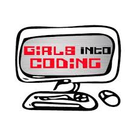
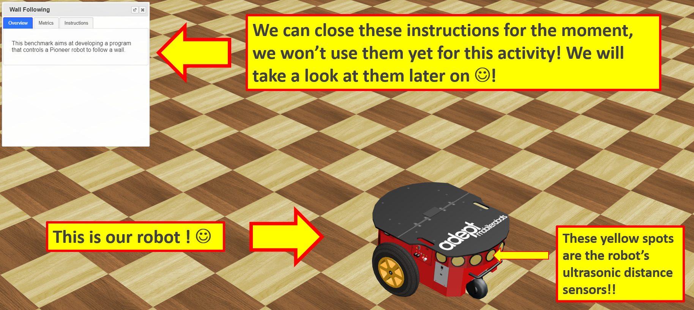

<!--Comment: Above here is the header, we need this to generate the web page-->

<!--Comment: This section is markdown-->

[](https://www.girlsintocoding.com/)

A project activity for [Girls Into Coding](https://www.girlsintocoding.com/) using a online version of the free open source [Webots](https://www.cyberbotics.com/) robot simulator.

This session is designed to be fun! The idea is that we can follow it together online, but that we can be free to move at our own pace. We're going to be doing some basic python programming in this activity. If you're not too familiar with Python, don't worry, you'll be able to follow along :) ! 

<!--Comment: End of markdown section-->

<!--Comment: This code here is html-->

<!--Comment: This is html paragraph spacing <br>-->
<br>
<br>

<!--Comment: This is html bootstrap-->
<div class="container p-3 my-3 bg-primary">
<h2>Contents</h2>
<ul class="list-group">
  <li class="list-group-item"><a href="#resourcesPanel">Resources</a></li>
  <li class="list-group-item"><a href="#Activity1">Pick and place example code</a></li>
</ul>
</div>

<div id="resourcesPanel" class="container p-3 my-3 bg-info">
<h2>Resources</h2> 
  <p>Here's some resources that may help with the activity</p>
<ul class="list-group">
  <a href="https://www.w3schools.com/python/" target="_blank" class="list-group-item list-group-item-action">Python tutorials at W3 Schools</a>
  <a href="https://www.pythoncheatsheet.org/" target="_blank" class="list-group-item list-group-item-action">Python cheatsheet</a>
  <a href="https://www.cyberbotics.com/doc/reference/index" target="_blank" class="list-group-item list-group-item-action">Webots documentation</a>
  <a href="https://robohub.org/30-women-in-robotics-you-need-to-know-about-2019/" target="_blank" class="list-group-item list-group-item-action">30 women in robotics you need to know about – 2019</a>
</ul>
</div>

<div id="sessionLinkPanel" class="container p-3 my-3 bg-warning">
<h2>Actvity series</h2> 
  <p>This activity session is part of a series on simulating robots, you can see links to all the activities in this series below!</p>
<ul class="list-group">
  <a href="https://meisben.github.io/girlsIntoCoding-robotbenchmark-activity/" target="_blank" class="list-group-item list-group-item-action"><b>Activity session 1:</b> Intro to robot simulation</a>
  <a href="https://meisben.github.io/girlsIntoCoding-robotbenchmark-activity2/" target="_blank" class="list-group-item list-group-item-action"><b>Activity session 2:</b> Pick and place with a robot arm</a>
</ul>
</div>

<!--Comment: This is the end of html bootstrap-->


<!--Comment: Paragrpah spacing-->
<br>
<br>


<!--Comment: This section is markdown again-->

# Let's get familiar with our mobile robot arm!
---

<!--Comment: End of markdown-->

<!--Comment: Back to html bootstrap -->

<div id="Activity1" class="container p-3 my-3 bg-primary text-primary">
<h2>Activity #1</h2>
</div>

<!--Comment: End of html bootstrap -->


<!--Comment: Back to markdown -->

* We'll be using the [robotbenchmark](https://robotbenchmark.net/) website.
* Click on the **Start** button next to the **Pick and place** activity
* Click on **Start programming this benchmark**
* Read the instructions in the top left hand corner of the screen. You can resize the instruction window by dragging its bottom corner.
* When you're ready to program the robot, right click on it, and select **Edit controller**

[](https://www.girlsintocoding.com/)

* A window will pop up with python code in it! This is how we program our virtual robot.
* Delete the code in the robot controller window
* Copy and paste the code from below into the robot controller window - this contains some useful examples and functions

<!--Comment: End of markdown -->

  
```python
"""Sample base code controller for the pick and place girls into coding activity"""

#---------------------
# Python library imports
#---------------------

from controller import Robot


#---------------------
# Starting up the robot
#---------------------

# Create the Robot instance.
robot = Robot()

# Get the time step of the current world.
timestep = int(robot.getBasicTimeStep())

# Inizialize base motors.
wheels = []
wheels.append(robot.getMotor("wheel1"))
wheels.append(robot.getMotor("wheel2"))
wheels.append(robot.getMotor("wheel3"))
wheels.append(robot.getMotor("wheel4"))
for wheel in wheels:
    # Activate controlling the motors setting the velocity.
    # Otherwise by default the motor expects to be controlled in force or position,
    # and setVelocity will set the maximum motor velocity instead of the target velocity.
    wheel.setPosition(float('+inf'))

# Initialize arm motors.
armMotors = []
armMotors.append(robot.getMotor("arm1"))
armMotors.append(robot.getMotor("arm2"))
armMotors.append(robot.getMotor("arm3"))
armMotors.append(robot.getMotor("arm4"))
armMotors.append(robot.getMotor("arm5"))
# Set the maximum motor velocity.
armMotors[0].setVelocity(1)
armMotors[1].setVelocity(0.5)
armMotors[2].setVelocity(0.5)
armMotors[3].setVelocity(0.3)

# Initialize arm position sensors.
# These sensors can be used to get the current joint position and monitor the joint movements.
armPositionSensors = []
armPositionSensors.append(robot.getPositionSensor("arm1sensor"))
armPositionSensors.append(robot.getPositionSensor("arm2sensor"))
armPositionSensors.append(robot.getPositionSensor("arm3sensor"))
armPositionSensors.append(robot.getPositionSensor("arm4sensor"))
armPositionSensors.append(robot.getPositionSensor("arm5sensor"))
for sensor in armPositionSensors:
    sensor.enable(timestep)

# Initialize gripper motors.
finger1 = robot.getMotor("finger1")
finger2 = robot.getMotor("finger2")
# Set the maximum motor velocity.
finger1.setVelocity(0.03)
finger2.setVelocity(0.03)
# Read the miminum and maximum position of the gripper motors.
fingerMinPosition = finger1.getMinPosition()
fingerMaxPosition = finger1.getMaxPosition()


#---------------------
# Helpful functions for controling the robot (for the girls into coding activity)
#---------------------

def stopRobotWheels():
    for wheel in wheels:
        wheel.setVelocity(0.0)

def moveForward(mySpeed, timeDuration):
    """
    Purpose: move the robot forward
    Notes: mySpeed -> can take values from 1-9
    """
    for wheel in wheels:
        wheel.setVelocity(mySpeed)
    # Wait until the robot completes the timeDuration for the movement
    robot.step(timeDuration)
    stopRobotWheels()

def moveBackward(mySpeed, timeDuration):
    """
    Purpose: move the robot backward
    Notes: mySpeed -> can take values from 1-9
    """
    for wheel in wheels:
        wheel.setVelocity(-mySpeed)
    # Wait until the robot completes the timeDuration for the movement
    robot.step(timeDuration)
    stopRobotWheels()

def turnLeft(mySpeed, timeDuration):
    """
    Purpose: turn the robot left
    Notes: mySpeed -> can take values from 1-9
    """
    wheels[0].setVelocity(mySpeed)
    wheels[1].setVelocity(-mySpeed)
    wheels[2].setVelocity(mySpeed)
    wheels[3].setVelocity(-mySpeed)
    # Wait until the robot completes the timeDuration for the movement
    robot.step(timeDuration)
    stopRobotWheels()
    
def turnRight(mySpeed, timeDuration):
    """
    Purpose: turn the robot right
    Notes: mySpeed -> can take values from 1-9
    """
    wheels[0].setVelocity(-mySpeed)
    wheels[1].setVelocity(mySpeed)
    wheels[2].setVelocity(-mySpeed)
    wheels[3].setVelocity(mySpeed)
    # Wait until the robot completes the timeDuration for the movement
    robot.step(timeDuration)
    stopRobotWheels()
    


#---------------------
# Enter your code below here for the girls into coding exercise to run the robot ! ! 
#---------------------

# Example of moving the robot around
moveBackward(mySpeed=5, timeDuration = 1000) # Time is in ms
turnLeft(mySpeed=5, timeDuration = 1000)
moveForward(mySpeed=5, timeDuration = 2000)
turnLeft(mySpeed=5, timeDuration = 2000)


# Example of moving the robot arm for the robot

# -- Open and close the robot gripper
finger1.setPosition(fingerMaxPosition)
finger2.setPosition(fingerMaxPosition)
robot.step(1000) # in milliseconds

finger1.setPosition(fingerMinPosition)
finger2.setPosition(fingerMinPosition)
robot.step(1000) # in milliseconds

print(fingerMaxPosition)
print(fingerMinPosition)

# -- Move the robot arm joints

# --- Joint #0
armMotors[0].setPosition(1)
robot.step(2000) # in milliseconds

armMotors[0].setPosition(0)
robot.step(2000) # in milliseconds

# --- Joint #1
armMotors[1].setPosition(-0.55)
robot.step(1000) # in milliseconds

armMotors[1].setPosition(0)
robot.step(1000) # in milliseconds

```
